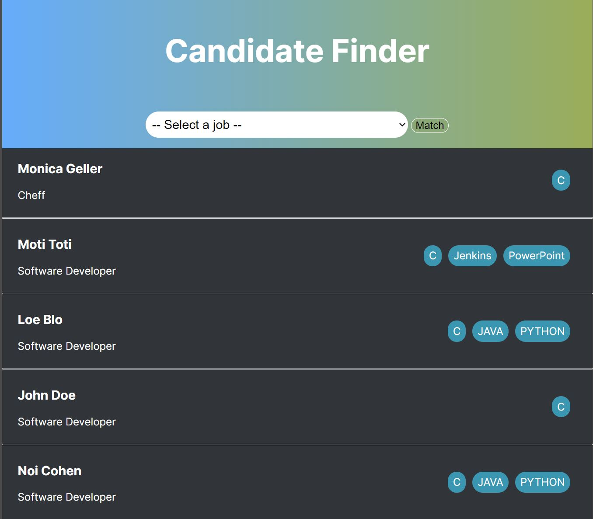
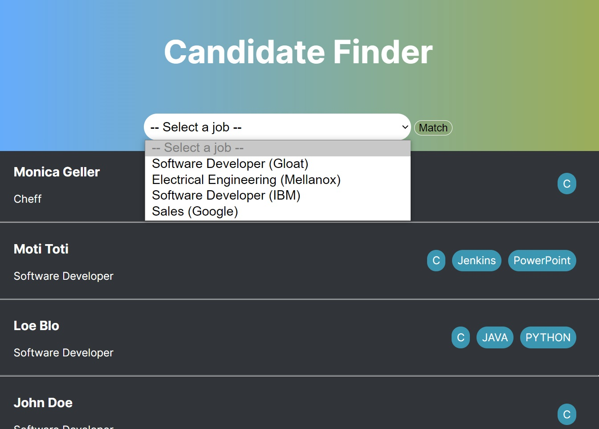

# Candidates Matcher

# instructions
1. Make sure python installed.
2. Install Django: pip install django
3. Download all files (code -> Download ZIP)
4. Extract the zip into a folder
5. Run the server: python manage.py runserver
6. Open http://127.0.0.1:8000/
7. For adding, removing, editing the database:
   - Create admin user: python manage.py createsuperuser
   - Use the username and password in http://127.0.0.1:8000/admin/ page
   - Edit the database

# Candidates Finder Use

Choose a job and get back the best ones for the Job. Considerations:
- Title match - for example, a "software developer" candidate is good for a "software developer" job
- Having as many skill matches as possible.

